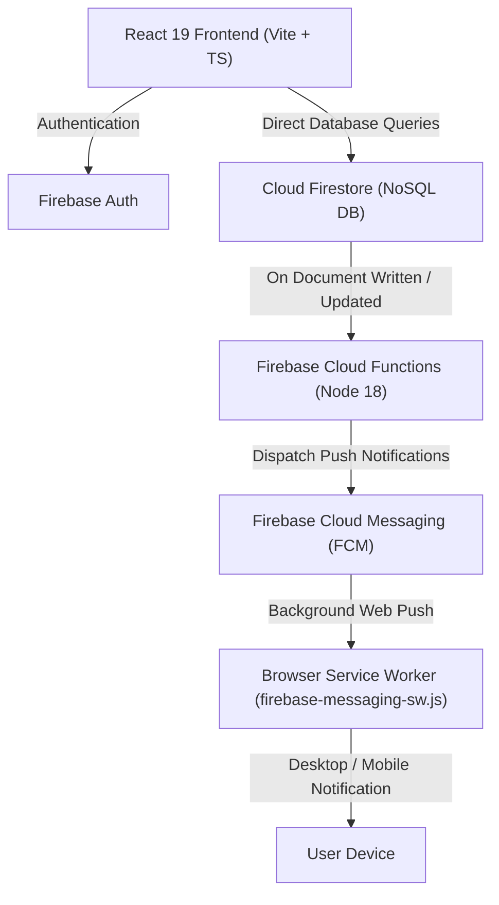

# FX OD Portal — Technical Architecture & Stack Guide

> **Project Name**: FX On-Duty (OD) Management Portal  
> **Repository**: `fx-od-app`  
> **Architecture**: Serverless BaaS (Backend-as-a-Service) Single Page Application (SPA)

---

## 1. Is this a FERN Stack?

### The Short Answer
**No, not in the traditional sense.** 

### Detailed Explanation
- **FERN Stack** typically stands for **F**irebase, **E**xpress.js, **R**eact, and **N**ode.js — where a traditional monolithic Express web server runs 24/7 on Node.js to serve custom REST API endpoints.
- **What this project actually uses**: A modern **Serverless Firebase + React (BaaS)** stack.
- **Why?** Instead of maintaining an Express.js backend server, this application uses **Direct Firebase Client SDKs** for real-time database queries (Firestore) and user authentication (Firebase Auth). Complex background tasks (like push notification dispatching) are offloaded to **Serverless Firebase Cloud Functions**, which run on-demand in Google Cloud's Node.js environment.

---

## 2. Complete Technology Stack Breakdown

| Technology / Library | Purpose in this Project | Where it is Used in Code |
| :--- | :--- | :--- |
| **React 19** | Core UI framework powering component-based Single Page Application (SPA) views. | Entire `src/` directory (`src/App.tsx`, `src/pages/`, `src/components/`) |
| **TypeScript 6** | Static typing, interface definitions for OD requests, user roles, and compile-time type safety. | `.ts` and `.tsx` files (`src/types/`, `src/schemas/`) |
| **Vite 8** | Next-generation build tool, local dev server with instant HMR (Hot Module Replacement), and production bundler. | [`vite.config.ts`](file:///d:/Git/fx-od-app/vite.config.ts), [`index.html`](file:///d:/Git/fx-od-app/index.html) |
| **Tailwind CSS v4** | Utility-first CSS framework for modern responsive UI design, dynamic themes, and dark mode styling. | [`src/index.css`](file:///d:/Git/fx-od-app/src/index.css) |
| **Firebase Authentication** | User identity management (Google Sign-In, Email/Password login, role mapping). | [`src/config/firebase.ts`](file:///d:/Git/fx-od-app/src/config/firebase.ts), [`AuthContext.tsx`](file:///d:/Git/fx-od-app/src/context/AuthContext.tsx) |
| **Cloud Firestore** | Serverless NoSQL document database providing real-time synchronization for OD requests, rosters, and audit logs. | `src/services/`, [`firestore.indexes.json`](file:///d:/Git/fx-od-app/firestore.indexes.json) |
| **Firebase Cloud Functions** | Serverless FaaS (Function-as-a-Service) running on Node.js 18 to trigger background FCM notifications. | [`functions/index.js`](file:///d:/Git/fx-od-app/functions/index.js), [`functions/package.json`](file:///d:/Git/fx-od-app/functions/package.json) |
| **Firebase Cloud Messaging (FCM)** | Background & foreground Web Push Notifications sent to devices when OD requests update. | [`public/firebase-messaging-sw.js`](file:///d:/Git/fx-od-app/public/firebase-messaging-sw.js) |
| **React Router DOM v7** | Client-side routing and Role-Based Access Control (RBAC) protecting Student, Mentor, and HOD views. | [`AppRoutes.tsx`](file:///d:/Git/fx-od-app/src/routes/AppRoutes.tsx), [`ProtectedRoute.tsx`](file:///d:/Git/fx-od-app/src/routes/ProtectedRoute.tsx) |
| **React Hook Form + Zod** | Form state management and schema validation ensuring submitted OD applications meet required rules. | `src/components/forms/ODForm.tsx`, `src/schemas/` |
| **SheetJS (`xlsx`)** | Client-side Excel export for generating downloadable OD attendance reports and audit logs. | `src/utils/exportToExcel.ts` |
| **Oxlint** | High-performance Rust-based Linter for ultra-fast JavaScript/TypeScript code quality checks. | [`.oxlintrc.json`](file:///d:/Git/fx-od-app/.oxlintrc.json) |

---

## 3. Application Architecture & Data Flow

1. **User Action**: A student submits an On-Duty (OD) application using [ODForm.tsx](file:///d:/Git/fx-od-app/src/components/forms/ODForm.tsx).
2. **Client Validation**: Zod validates input parameters (date ranges, reasons, supporting documents).
3. **Database Write**: Firestore SDK writes a new document to the `od_requests` collection.
4. **Real-time Listener**: Mentors and HODs subscribed to Firestore (`onSnapshot`) see the new request immediately on their dashboard.
5. **Serverless Trigger**: Firestore triggers `functions/index.js` in the cloud, which sends an FCM notification to the student's assigned Mentor.

---

## 4. Role-Based Access Control (RBAC)

The application supports 4 distinct user roles:

- **Student**: Applies for OD, views status history, receives push notifications.
- **Mentor**: Reviews assigned students' requests, approves/rejects initial level, views roster.
- **HOD (Head of Department)**: Gives final approval for multi-day/department OD requests, views analytics.
- **Admin**: Manages user accounts, department rosters, and views audit logs.

RBAC is enforced both on the **Frontend** ([ProtectedRoute.tsx](file:///d:/Git/fx-od-app/src/routes/ProtectedRoute.tsx)) and on the **Backend** via Firestore Security Rules.

---

## 5. Viva Voce Study Guide (Top 10 Questions & Answers)

### Q1: What architecture does this project follow?
> **Answer**: It follows a **Serverless BaaS (Backend-as-a-Service)** architecture. The frontend is a React 19 Single Page Application built with Vite and TypeScript, while backend data persistence, authentication, push messaging, and hosting are handled by Google Firebase.

### Q2: Why is this not a traditional MERN/FERN stack with Express?
> **Answer**: In a traditional FERN stack, Express.js acts as a middleware web server running on Node.js to handle custom REST endpoints. Here, we eliminated server management overhead by querying Firestore directly via client SDKs and handling asynchronous logic with event-driven Firebase Cloud Functions.

### Q3: What is the benefit of using Cloud Firestore over a traditional SQL database (e.g., MySQL)?
> **Answer**: 
> 1. **Real-time Synchronization**: Firestore supports WebSocket-based `onSnapshot` listeners, updating UI tables instantly without manual polling.
> 2. **Flexible Document Schema**: OD request metadata (e.g., certificate attachments, event tags) can be nested flexibly as JSON documents.
> 3. **Automatic Scaling**: No manual database server provisioning or connection pooling required.

### Q4: What is the role of Firebase Cloud Functions (`functions/index.js`)?
> **Answer**: Cloud Functions run in a secure, serverless Node.js environment isolated from the browser. They use the `firebase-admin` SDK to handle privileged tasks—specifically sending background FCM push notifications whenever an OD request changes state (Pending -> Approved / Rejected).

### Q5: How do background push notifications work if the web tab is closed?
> **Answer**: A Service Worker ([`firebase-messaging-sw.js`](file:///d:/Git/fx-od-app/public/firebase-messaging-sw.js)) registers with the browser's Push API. When Firebase Cloud Messaging sends a push payload, the Service Worker catches the event in the background thread and displays a native system notification.

### Q6: How is type safety maintained across the project?
> **Answer**: Using **TypeScript 6** interfaces (`src/types/`) and **Zod** schemas (`src/schemas/`). Zod validates data incoming from forms at runtime, while TypeScript ensures compile-time checks across components.

### Q7: Why use Vite instead of Create React App (CRA)?
> **Answer**: Vite uses native ES modules (ESM) and esbuild during development, providing instant dev server startup times and extremely fast Hot Module Replacement (HMR) compared to CRA's Webpack bundling.

### Q8: How does the application prevent unauthorized access?
> **Answer**: Access is secured at two levels:
> 1. **Client-Side**: `ProtectedRoute.tsx` checks the current user's authenticated role in `AuthContext` before mounting restricted routes.
> 2. **Server-Side**: Firestore Security Rules validate user identity tokens and restrict read/write access at the database level.

### Q9: How are Excel reports generated for attendance records?
> **Answer**: The application uses **SheetJS (`xlsx`)** on the client side. Data fetched from Firestore is parsed into JSON workbooks and converted to binary `.xlsx` files for instant browser download without requiring server processing.

### Q10: How do you handle environment variable security?
> **Answer**: Secrets and keys are configured via `.env` files (prefixed with `VITE_` for Vite exposure). Critical private keys are excluded from git repository tracking via [.gitignore](file:///d:/Git/fx-od-app/.gitignore), while `.env.example` provides an environment template for team members.
